# :bookmark: Luxxy COVID Testing System
This is an example application provided by [Intensive Cloud Computing Hands-On Training](https://ref.thecloudbootcamp.com/lp/137369/lp137369).

The BASH and Terraform code is provided also by them.

## Goal
- Build a multicloud application to manage the COVID Tests with the power of the automated scripts.

## Step 1
- Create a new AWS free tier account.
- Create a new GCP free account.

## Step 2
- Use Terraform to implement Infrastructure as a Code (IaC) to build:
  - AWS S3 Bucket.
  - GCP GKE Kubernetes Cluster.
  - GCP MySQL Database.

# Process
1. Download the code provided by [Intensive Cloud Computing Hands-On Training](https://ref.thecloudbootcamp.com/lp/137369/lp137369).

2. Access GCP Console and open Cloud Shell

    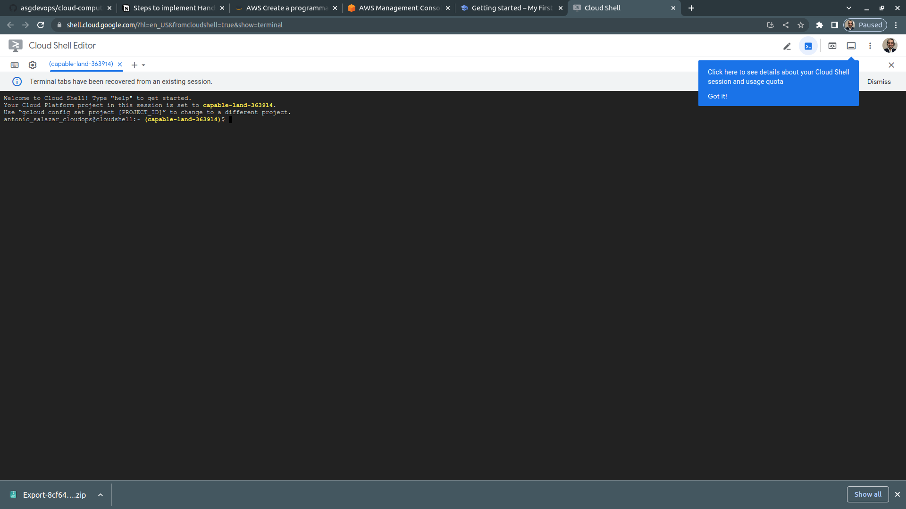

3. Upload accessKeys.csv and .zip hands-on file to GCP Cloud Shell

    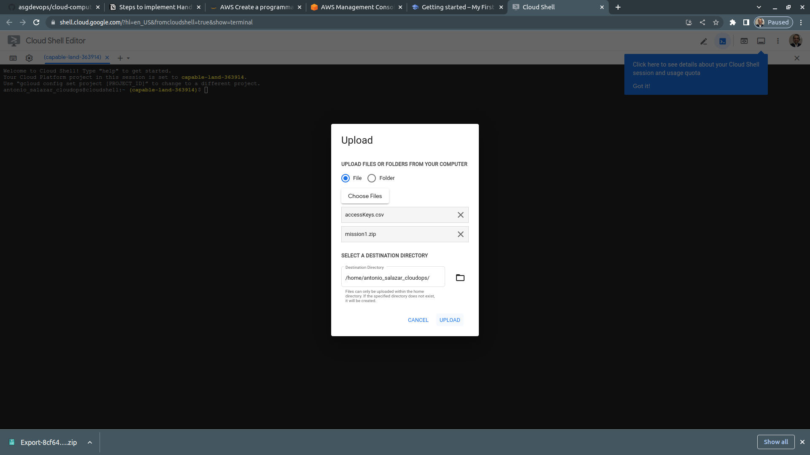

4. Run the Hands-on files preparation below
    ```bash
    mkdir mission1_en
    mv mission1.zip mission1_en
    cd mission1_en
    unzip mission1.zip
    mv ~/accessKeys.csv mission1/en
    cd mission1/en
    chmod +x *.sh
    ```
    
    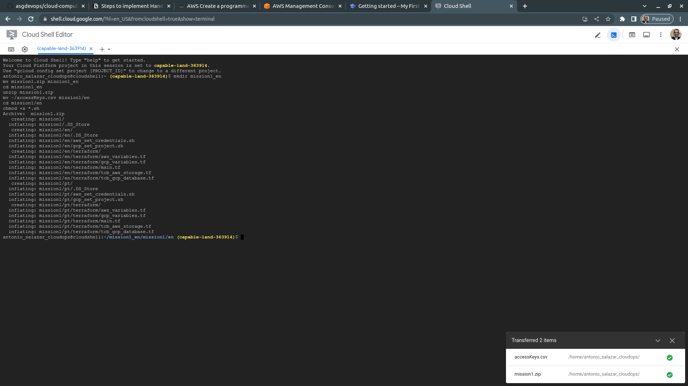

5. Run the following commands to prepare AWS and GCP environment. Authorize when asked.
    ```bash
    ./aws_set_credentials.sh accessKeys.csv
    ```

- Take the project Id from the GCP Console `My First Project` and execute the cpommand below:
    ```bash
    gcloud config set project <project_id>
    ```
    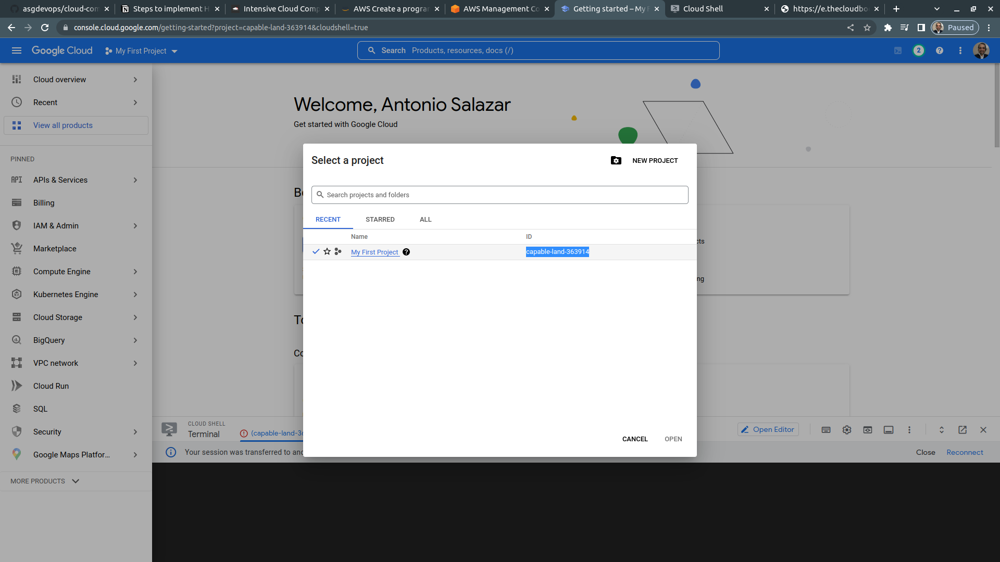

6. Execute the command below
    ```bash
    ./gcp_set_project.sh
    ```

7. Enable the Container Registry API, Kubernetes Engine API and the Cloud SQL API
    ```bash
    gcloud services enable containerregistry.googleapis.com 
    gcloud services enable container.googleapis.com 
    gcloud services enable sqladmin.googleapis.com 
    ```

    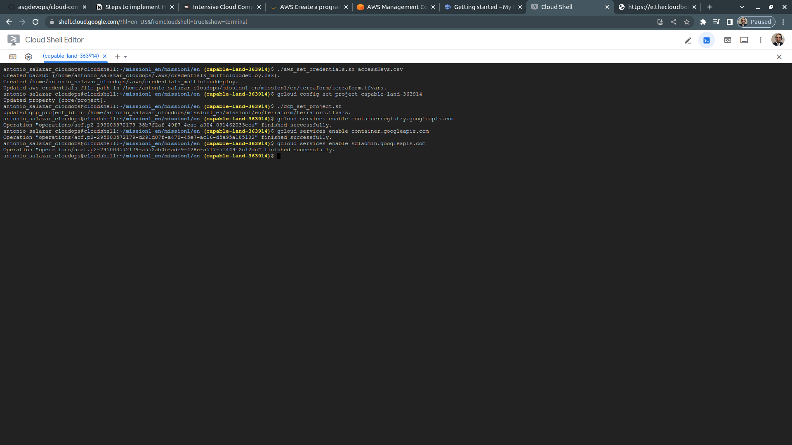


8. **IMPORTANT (DO NOT SKIP):**

- **Before executing the Terraform commands, open the Google Editor and update the file tcb_aws_storage.tf replacing the bucket name with an unique name (AWS requires unique bucket names).**
    - Open the tcb_aws_storage.tf using Google Editor
    - On line 4 of the file tcb_aws_storage.tf:
        - Replace xxxx with your name initials plus two random numbers:
        Example: luxxy-covid-testing-system-pdf-en-jr29

    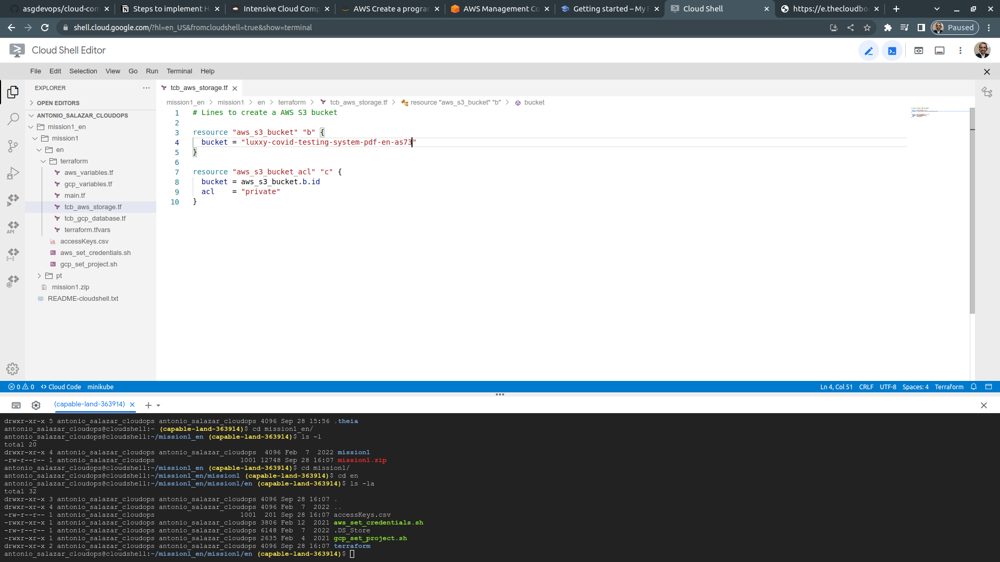

9. Run the following commands to finish provision infrastructure steps
    ```bash
    cd ~/mission1_en/mission1/en/terraform/

    terraform init
    terraform plan
    terraform apply

    #	Type Yes and go ahead.
    ```

    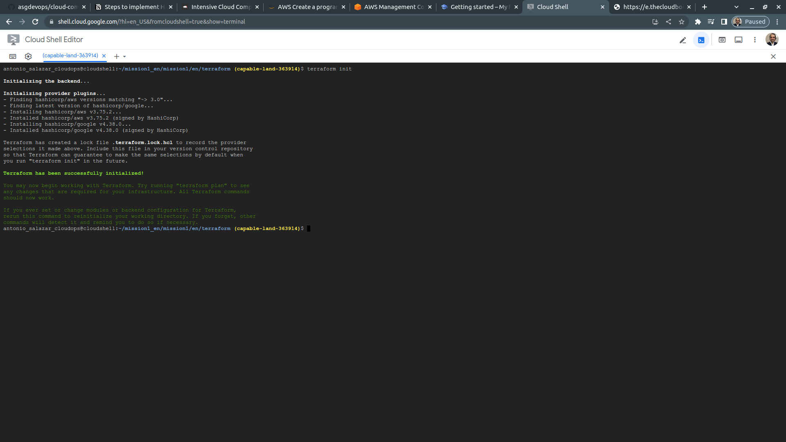

    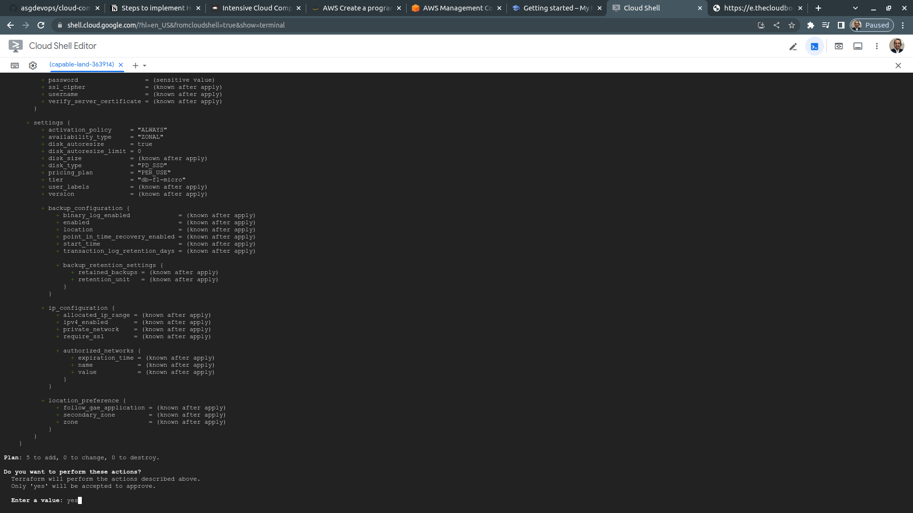

10. Once the CloudSQL instance is provisioned, access the Cloud SQL service
11. Click on your Cloud SQL instance.
12. On the left side, under Primary Instance, click on **Connections**.

13. Under **Instance IP assignment**, enable Private IP.
    - Click **Set up Connection** and **Use an automatically allocated IP range in your network**.
    - Click **Continue**
    - Click **Create Connection** and **wait a minutes.**

    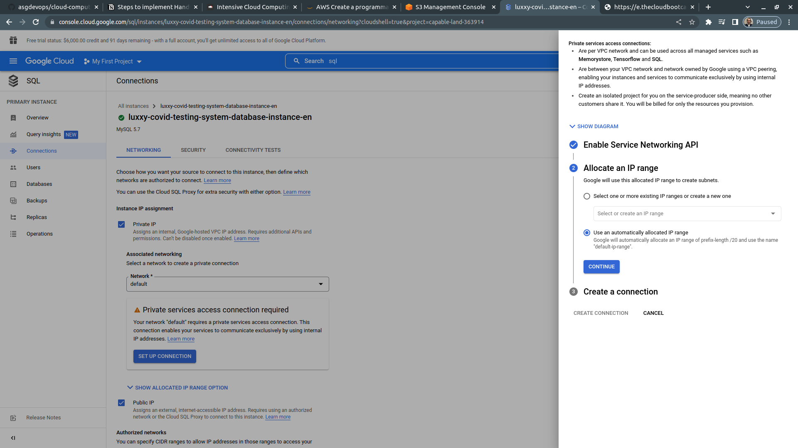
    
    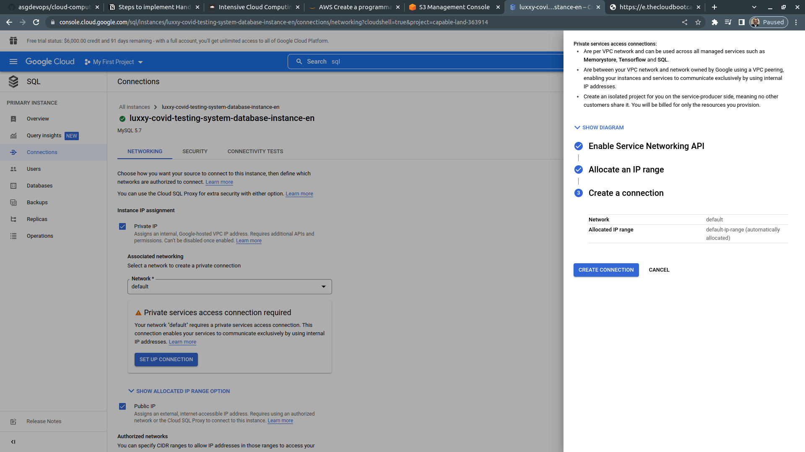

14. Under **Associated networking**, select "Default".
15. Under **Authorized Networks**, click "Add Network".
16. Under **New Network**, enter the following information:
    - **Name:** Public Access (For testing purposes only)
    - Network:** 0.0.0.0/0
    - Click **Done**.

    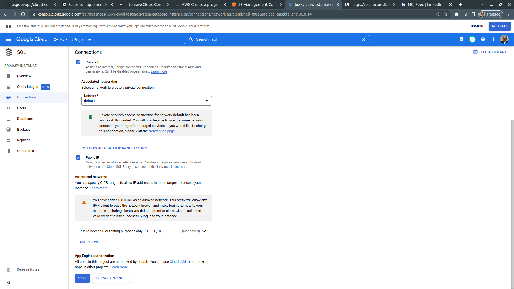

PS: For production environments, it is recommended to use only the Private Network for database access. 

⚠️  Never grant public network access (0.0.0.0/0) to production databases.

1.  After that, click on Save and wait to conclude the update.

# Scripts
## BASH
- [aws_set_credentials.sh](scripts/bash/aws_set_credentials.sh)
- [gcp_set_project.sh](scripts/bash/gcp_set_project.sh)

## Terraform
- [aws_variables.tf](scripts/terraform/aws_variables.tf)
- [gcp_variables.tf](scripts/terraform/gcp_variables.tf)
- [main.tf](scripts/terraform/main.tf)
- [tcb_aws_storage.tf](scripts/terraform/tcb_aws_storage.tf)
- [tcb_gcp_database.tf](scripts/terraform/tcb_gcp_database.tf)

# Example Screen-shots

## **AWS S3 Bucket**
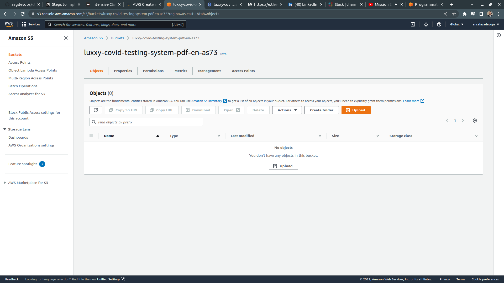

## **GCP Kubernetes Cluster**
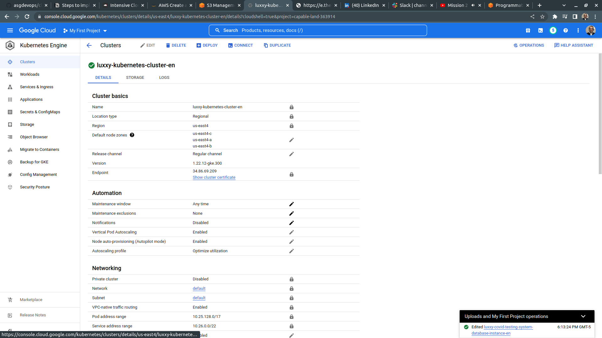

## **GCP MySQL Database**
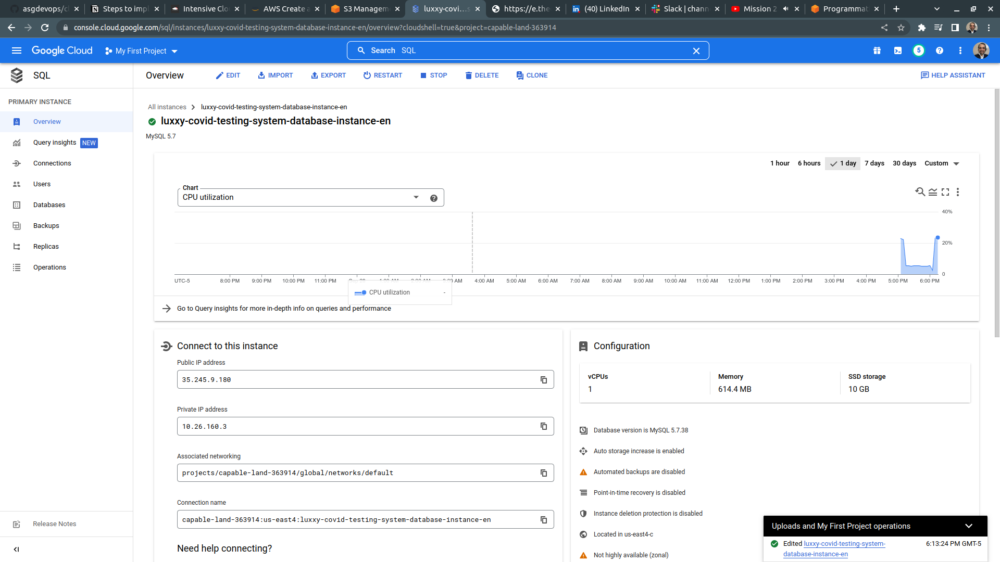


# :books: References
- :link: [Intensive Cloud Computing Hands-On Training](https://ref.thecloudbootcamp.com/lp/137369/lp137369)
