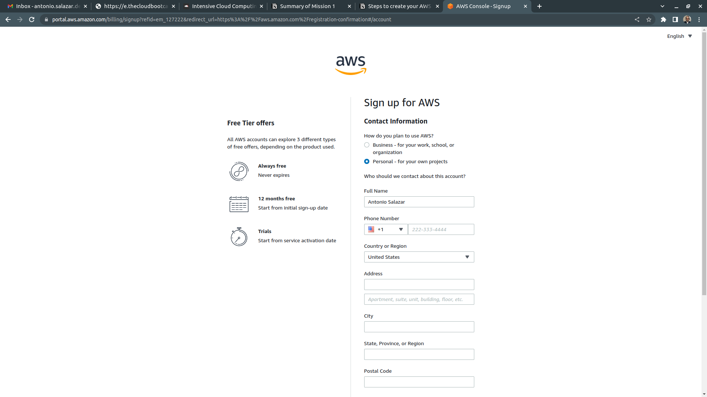

# :notes: Create a new AWS free tier account

By [Antonio Salazar](mailto:antonio.salazar.devops@gmail.com) - September 28th, 2022

# :paw_prints: Steps

1. Open a browser and go to [https://aws.amazon.com/free/](https://aws.amazon.com/free/)
2. Click on **Create a Free Account.**
    
    
    
3. Enter the **Root user email address** and the **AWS account name** accordingly.
    
    
    
4. Get the verification code from your email address.
    
    
    
5. Enter the Verification code.
    
    
    
6. Set a new **Root user password**
    
    
    
7. Input the **Contact information**
    
    
    
8. Provide the **Billing Information**
    
    
    
9. **Confirm your Identity (**1 of 2): AWS sends a SMS verification code to your mobile.
    
    
    
10. **Confirm your Identity (**2 of 2): take the verification and provide that back to AWS.
    
    
    
11. Select the **Basic support - Free** plan
    
    
    
12. **Go to the AWS Management Console**
    
    
    
13. Sign in with your **Root user email address** credentials
    
    
    
14. Feed the **Security check**
    
    
    
15. Enter the **Root user password**
    
    
    
16. Look for the Region’s menu
    
    
    
17. Pick up the **US East (N. Virginia)** option if not selected already.
    
    
    
18. **Congratulations!** You are all set. **Enjoy!**

# :books: References
- :link: [Intensive Cloud Computing Hands On Training](https://ref.thecloudbootcamp.com/lp/137369/lp137369)
