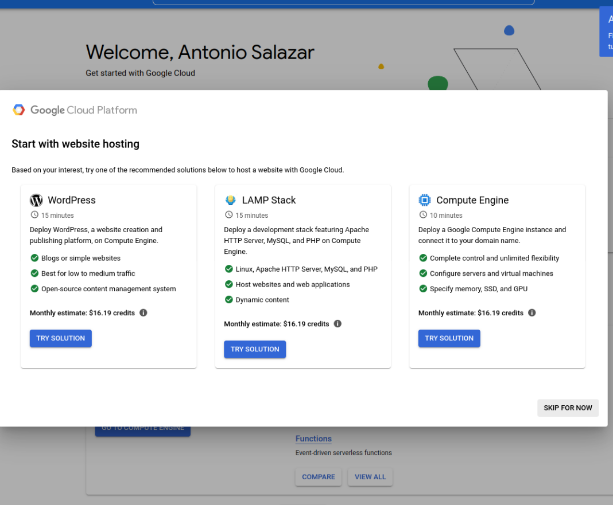

# :notes: Create a new GCP free account

By [Antonio Salazar](mailto:antonio.salazar.cloudops@gmail.com), September 28th, 2022

# :paw_prints: Steps

1. Open a browser as **Guest** and go to [**https://console.cloud.google.com/freetrial**](https://console.cloud.google.com/freetrial)
2. Type your **Email or phone** address
    
    
    
3. **Enter your password**
    
    
    
4. Account Information 1 of 2: provide the **Country**, **What best describes your organization or needs?** and, the **Terms of Service**
    
    
    
5. Account Information 2 of 2: provide the **Account type** and **Payment method**.
    
    
    
6. **What brought you to Google Cloud?**
    
    
    
7. What are you interested in doing with Google Cloud?
    
    
    
8. What best describes your role?
    
    
    
9. **SKIP FOR NOW**
    
    
    
10. **Congratulations you are all set! Enjoy!**
    
    